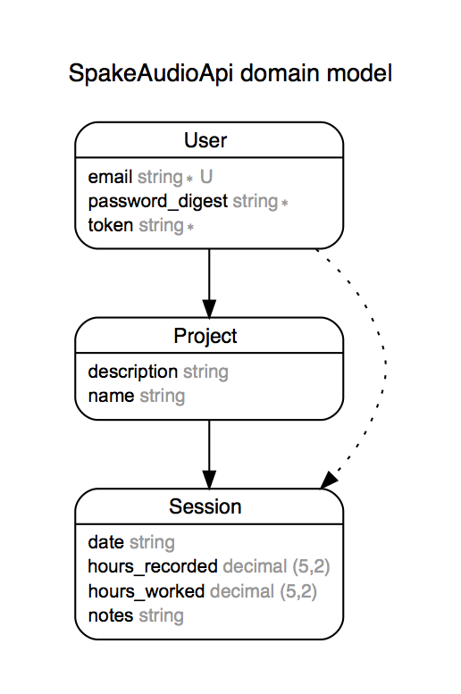

# SPAKE Audio #

## Capstone Project • back-end ##

### Description ###

SPAKE Audio is web application that allows users to sign up, sign in and track
their progress on a recording project.

### Links ###

* API Repository – https://github.com/joelthibodeau/spake-audio-api
* Client Repository – https://github.com/joelthibodeau/spake-audio-client
* Deployed back-end – https://spake-audio-api.herokuapp.com/
* Deployed front-end – https://joelthibodeau.github.io/spake-audio-client/

### Technologies ###

SPAKE Audio is my fourth project in General Assembly's Web Development Immersive
program. I used JavaScript, CSS/Sass, HTML5, jQuery and Bootstrap to build the
front-end, and Ruby on Rails along with heroku for the back-end to create this
single page application.

### Installation ###

Install dependencies for the front-end repo by running:
```npm install```, then
```npm run start```

Install dependencies for the back-end repo by running:
```bundle install```, then
```bin/rails server```

### Routes ###

#### User ####

/sign-in : POST

/sign-up : POST

/change-password : PATCH

/sign-out : DELETE

##### Projects #####

/projects : GET

/projects : POST

/projects/${id} : PATCH

/projects/${id} : DELETE

##### Sessions #####

/sessions : GET

/sessions : POST

/sessions/${id} : PATCH

/sessions/${id} : DELETE


### User Stories ###

* As a user, I want to sign up by creating an account with an email address & password.
* As a user, I want to sign in with my email address & password.
* As a user, I want to have the option to change my password.
* As a user, I want to create a recording project with a name and description.
* As a user, I want to upload an mp3 sample file for each project.
* As a user, I want to view my saved projects.
* As a user, I want to playback an mp3 sample file that I've uploaded for each project.
* As a user, I want to update/edit any project by ID.
* As a user, I want to delete a project by ID.
* As a user, I want to create a recording session with a date, hours worked, hours recorded
* As a user, I want to view my saved sessions.
* As a user, I want to update/edit any session by ID.
* As a user, I want to delete a session by ID.
* As a user, I want to view the total number of hours worked.
* As a user, I want to view the total number of hours recorded.
* As a user, I want the option to generate, save and print an invoice as a pdf.
* As a user, I want to sign out.

### Entity Relationship Diagram (ERD) ###



### Planning & Future Iterations ###

The current version of SPAKE Audio is a work in progress. Future iterations
will fulfill the functionality expected in the user stories and have a finished
front-end design. I plan to use learn handlebars to display projects and
sessions in a way that is usefule and meaningful to the user.
